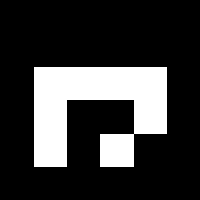
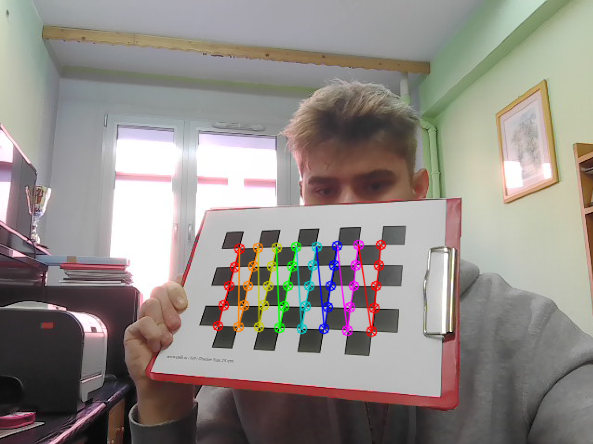
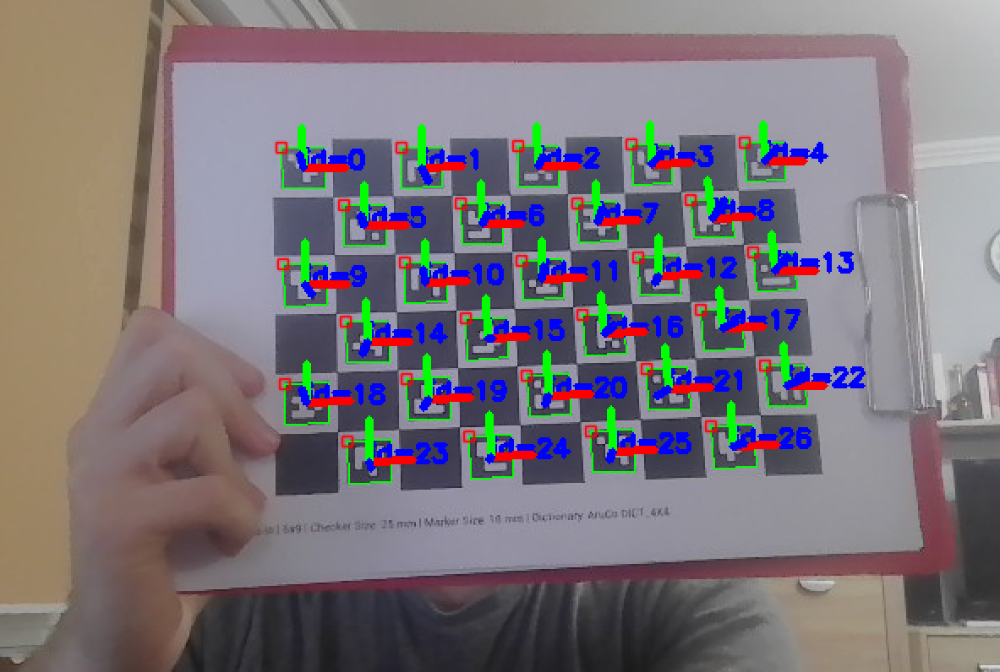

# ArUco Markers
ArUco markers are synthetic square markers used in computer vision for tasks like camera pose estimation, object tracking, and augmented reality. They consist of a black border and an inner binary matrix that encodes a unique identifier, making them robust and easy to detect. The ArUco project, originally designed for augmented reality applications, comes from Rafael Munoz and Sergio Garrido:<br> <br>
*S. Garrido-Jurado, R. Munoz-Salinas, F. J. Madrid-Cuevas, and M. J. Marin-Jimenez. 2014. "Automatic generation and detection of highly reliable fiducial markers under occlusion". Pattern Recogn. 47, 6 (June 2014), 2280-2292. DOI=10.1016/j.patcog.2014.01.005*

<p align="center">
    
</p>

We have decided to uze `DICT_4X4_1000` ArUco dictionary, because markers are much easier to read than the higher resolution solution markers.

## Marker Generation
This project uses OpenCV to generate ArUco Marker fiducial markers. These markers are commonly used in robotics, augmented reality, and camera pose estimation.

### Requirements
Install OpenCV with the ArUco module:
```
pip install opencv-python opencv-contrib-python
```

The `opencv-contrib-python` package is required because the ArUco module is part of the OpenCV contrib modules.


### ArUco Dictionary

Markers are generated using a predefined ArUco dictionary. Each dictionary contains a fixed number of unique marker patterns.

ArUco dictionaries define the marker grid size and the number of unique markers available. Choosing the right dictionary depends on your project needs: smaller grids are faster to detect, larger grids are more robust. Here are some examples:

| Dictionary Name       | Grid Size | Number of Markers | Use Case                     |
|----------------------|-----------|-----------------|------------------------------|
| `DICT_4X4_50`        | 4×4       | 50              | Simple projects, fast detection |
| `DICT_5X5_100`       | 5×5       | 100             | Moderate tracking, more IDs |
| `DICT_6X6_250`       | 6×6       | 250             | Robotics, AR, medium-scale environments |
| `DICT_7X7_1000`      | 7×7       | 1000            | Large-scale tracking, high robustness |
| `DICT_ARUCO_ORIGINAL_4X4_50` | 4×4 | 50         | Original 4×4 ArUco markers |

### Script
The `aruco_generation.py` script allows you to generate individual ArUco markers. You can set marker IDs, image size in pixels bits.

## Camera Calibration

### Chessboard Detection
Camera calibration is the process of estimating the parameters of a camera to correct distortions and map 3D points in the real world to 2D points in an image. This is typically done using known patterns, like a chessboard or circle grid, which allows precise measurement of points in both 3D space and image coordinates.

<p align="center">
    
</p>

### Camera Matrix & Distortion Coefficients
1. **Camera matrix**: is a 3×3 matrix that encodes the intrinsic parameters of the camera. <a href="https://en.wikipedia.org/wiki/Camera_matrix">For more check wikipedia</a>

2. **Distortion Coefficients**: Most lenses introduce distortions. The two most common types are:

- *Radial distortion* – causes straight lines to appear curved, especially near image edges.

- *Tangential distortion* – happens if the lens and sensor are not perfectly parallel. <a href="https://en.wikipedia.org/wiki/Distortion_(optics)">For more check wikipedia</a>

### Script
The `chessboard_detection.py` script allows you check if your chessboard images are recognized by opencv's algorithm. When all of your images are okay, you are ready to calibrate your camera by running `camera_calibration.py`. After running the script your camera parameters will be in *assets/calibration-data* folder.

## Marker Detection & Pose Estimation

### Robust Detection
Markers are identified in the image using a predefined marker dictionary. Each detected marker provides a unique ID along with its corner positions in the image. Detection is robust to multiple markers appearing simultaneously, and the system can handle various marker types and sizes.

<p align="center">
    
</p>

Once markers are detected, their position and orientation in 3D space are estimated relative to the camera. This requires prior camera calibration, including the intrinsic camera matrix and lens distortion coefficients. The result is a rotation and translation for each marker, which allows for accurate placement of virtual objects or spatial measurements.


### Script
The *aruco_easy_detection.py*: identifies each marker by its unique ID and locates its corners within the frame. Detection works with multiple markers at once.
<br>

The *aruco_pose_estimation.py*: using a calibrated camera, it computes the rotation and translation of each marker, providing information about its position and orientation in space.